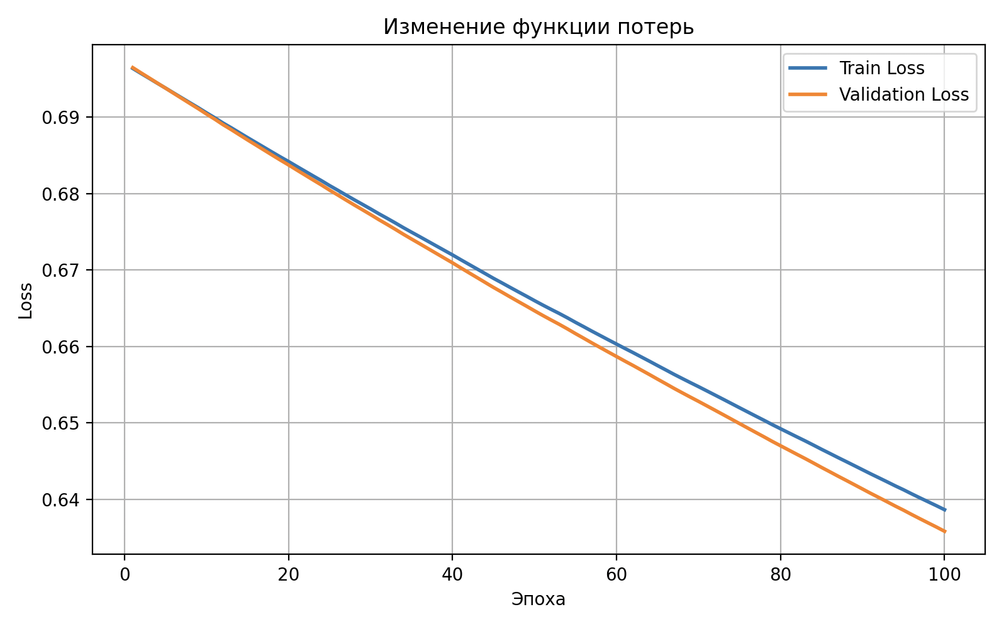
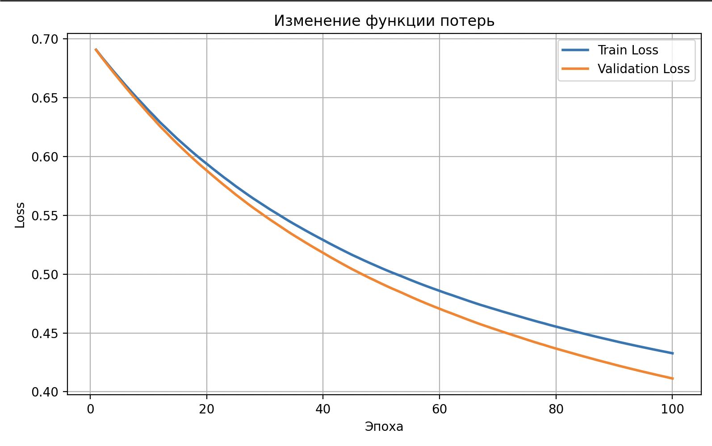
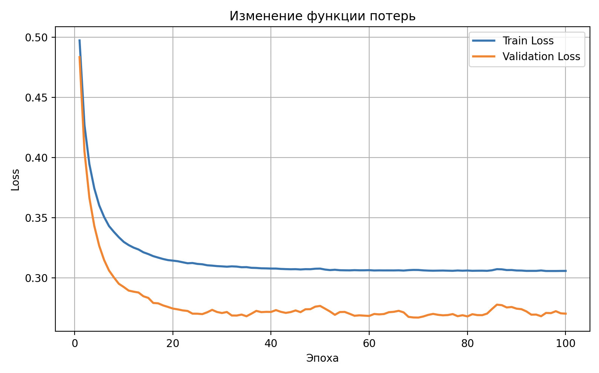
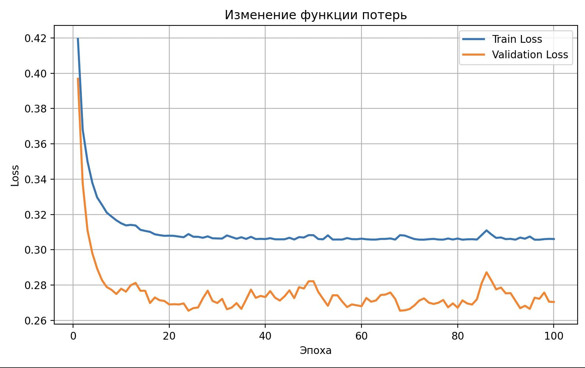
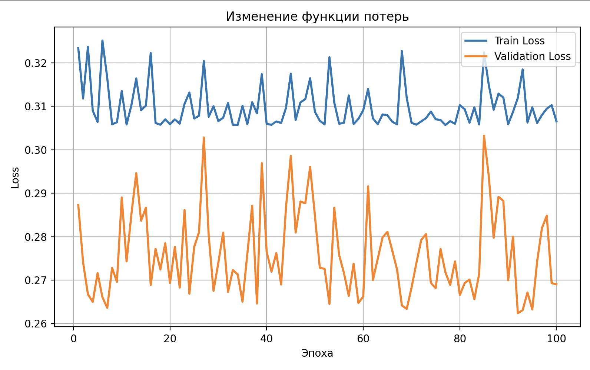
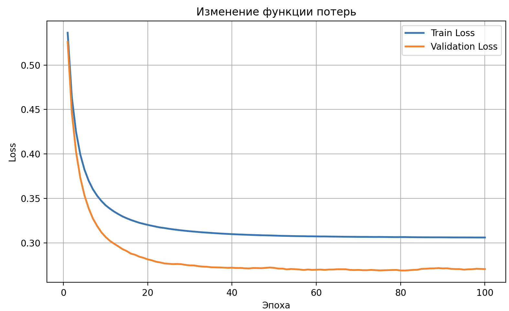
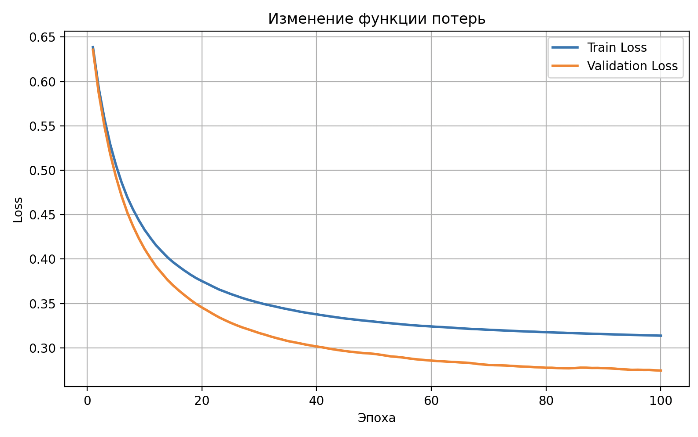
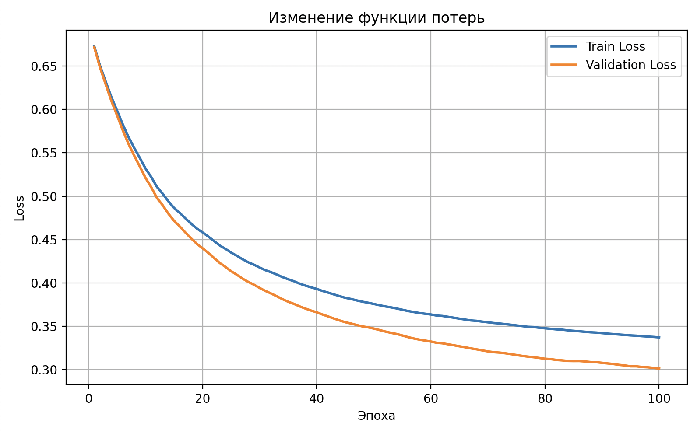
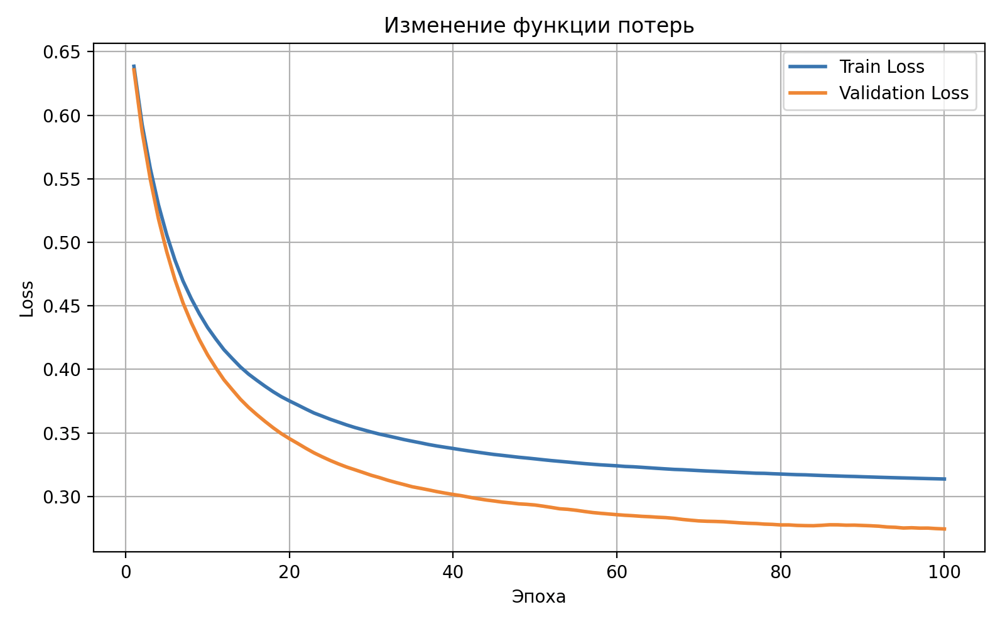
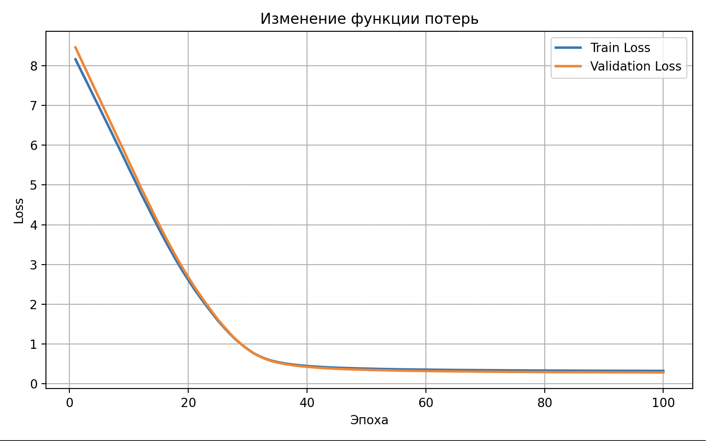

# Анализ результатов экспериментов с однослойным перцептроном

## Базовые параметры экспериментов

Во всех экспериментах изменялся только один исследуемый параметр, а остальные оставались фиксированными:

- `lr = 0.1`
- `batch_size = 32`
- `epochs = 100`
- `init_mode = "random_small"`
- `random_state = 42`

Это означает, что при исследовании скорости обучения менялся только `lr`, при исследовании размера батча менялся только `batch_size`, а при исследовании инициализации менялся только `init_mode`.

## Анализ влияния скорости обучения

### Результаты

| Скорость обучения | Train accuracy | Test accuracy |
|--------|--------|-------|
| 0.001 | 0.8719 | 0.8389 |
| 0.01  | 0.8719 | 0.8322 |
| 0.5   | 0.8826 | 0.8658 |
| 1.0   | 0.8826 | 0.8658 |

### Анализ

При `lr = 0.001` функция потерь убывает очень медленно. Это означает, что шаг обновления весов слишком маленький, поэтому модель движется к минимуму функции потерь очень осторожно. За 100 эпох перцептрон не успевает прийти к более качественному решению, поэтому итоговая тестовая точность оказывается ниже, чем у более удачных значений `lr`.

При `lr = 0.01` ситуация улучшается: loss уменьшается быстрее, чем при `0.001`, однако сходимость всё ещё остаётся сравнительно медленной. Модель обучается корректно, но не достигает столь хорошего решения, как при больших значениях скорости обучения.

При `lr = 0.5` график loss убывает быстро, но линия уже не выглядит идеально гладкой. На графике появляются небольшие волны и колебания. Обновление весов становится агрессивнее, поэтому модель может не только двигаться к минимуму, но и слегка "перешагивать" через него, после чего возвращаться обратно. Дополнительную неровность в график вносит мини-батч обучение: градиент оценивается не по всей выборке сразу, а по батчам, поэтому каждое обновление содержит небольшой стохастический шум. При этом важно, что общий тренд loss остаётся убывающим, а accuracy получается высокой. Следовательно, такие колебания не означают ошибку, а указывают на более быстрое и энергичное обучение.

При `lr = 1.0` тот же эффект выражен ещё сильнее. График также остаётся убывающим, но колебания становятся заметнее. Причина та же: шаг обучения достаточно большой, поэтому алгоритм движется к минимуму быстрее, но при этом сильнее колеблется около хорошей области решения. Несмотря на это, в данном эксперименте расходимости не наблюдается: значения loss продолжают уменьшаться, а итоговая точность остаётся такой же высокой, как и при `lr = 0.5`. Значит, для данной задачи `lr = 1.0` всё ещё допустим, хотя и менее "спокойный" по графику.

### Вывод

Слишком маленькие значения `lr` (`0.001` и `0.01`) приводят к медленной сходимости и недообучению модели за фиксированное число эпох. Более крупные значения `0.5` и `1.0` обеспечивают более быструю сходимость и лучшую точность. Небольшая волнистость графиков при `lr = 0.5` и `lr = 1.0` объясняется крупным шагом обновления и стохастичностью мини-батч градиентного спуска, а не ошибкой реализации.

## Анализ влияния размера батча

### Результаты

| Размер батча | Train accuracy | Test accuracy |
|-----|--------|--------|
|  1  | 0.8826 | 0.8591 |
| 16  | 0.8826 | 0.8658 |
| 64  | 0.8754 | 0.8658 |
| 256 | 0.8754 | 0.8591 |

### Анализ

При `batch_size = 1` обучение веса обновляются после каждого одного объекта. Из-за этого график loss получается самым шумным: отдельные объекты могут сильно различаться по сложности, поэтому после одного обновления loss может уменьшиться, а после следующего немного увеличиться. На графике видно, что значения loss колеблются около уровня примерно `0.27` на валидации и `0.31` на обучении. Значение около `0.27` означает, что модель уже обучилась достаточно хорошо, но из-за сильной стохастичности отдельных обновлений график остаётся рваным даже в конце обучения.

При `batch_size = 16` обучение становится заметно более устойчивым: каждая оценка градиента вычисляется уже по группе объектов, а не по одному примеру. Поэтому шум уменьшается, график становится плавнее, а итоговая точность остаётся высокой.

При `batch_size = 64` график ещё более гладкий. Это достаточно сбалансированный вариант: обновления весов происходят не слишком часто, но каждое обновление основано на более устойчивой оценке градиента. Поэтому loss убывает плавно и предсказуемо.

При `batch_size = 256` обучение становится самым инертным. Батч почти сравним по размеру с обучающей выборкой, поэтому обновления весов происходят редко и движение к минимуму замедляется. График loss получается гладким, но сходится медленнее. Точность при этом немного ниже, чем при `16` и `64`.

### Вывод

Маленький батч даёт шумное, но часто достаточно эффективное обучение. Очень большой батч делает обучение более плавным, но менее гибким и более медленным. В данном эксперименте лучшим компромиссом между устойчивостью и качеством оказались `batch_size = 16` и `batch_size = 64`.

## Анализ влияния инициализации весов

### Результаты

| Инициализация | Train accuracy | Test accuracy |
|------------------------|--------|--------|
| Нулевая                | 0.8754 | 0.8658 |
| Малые случайные веса   | 0.8754 | 0.8658 |
| Большие случайные веса | 0.8754 | 0.8658 |

### Анализ

Нулевая инициализация и инициализация малыми случайными весами дали почти одинаковые графики loss и одинаковые итоговые значения accuracy. Для однослойного перцептрона это допустимо, потому что здесь нет нескольких одинаковых скрытых нейронов, для которых возникала бы серьёзная проблема симметрии.
init mode zero

init mode small

Большая инициализация весов приводит к очень большим начальным значениям loss. Это связано с тем, что большие веса дают большие по модулю значения линейной комбинации `z`, а сигмоида в таких условиях быстро насыщается. В начале обучения это ухудшает поведение функции потерь и может затруднить обновление параметров. Однако в данной задаче модель всё же смогла скорректировать веса и прийти к близкому качеству, так как сама задача бинарной классификации сравнительно проста.

### Вывод

Для данной архитектуры и этого набора данных малая случайная инициализация является наиболее безопасным и стандартным выбором. Нулевая инициализация тоже оказалась работоспособной, а большая инициализация ухудшила начальный этап обучения, хотя и не испортила итоговую точность.

## Общий итог

Проведённые эксперименты показали, что:

- слишком маленькая скорость обучения замедляет сходимость и ухудшает качество модели за фиксированное число эпох;
- слишком большой шаг делает график loss менее гладким, но в данной задаче `lr = 0.5` и `lr = 1.0` всё ещё работают устойчиво;
- маленький батч увеличивает шум на графике функции потерь, потому что градиент оценивается по одному объекту;
- большой батч делает обучение более плавным, но более медленным;
- для однослойного перцептрона малая случайная инициализация весов является наиболее естественным вариантом.

Наиболее удачными параметрами по совокупности качества и характера сходимости можно считать:

- `lr = 0.5` или `lr = 1.0`;
- `batch_size = 16` или `batch_size = 64`;
- `init_mode = "random_small"`.

Таким образом, однослойный перцептрон успешно решает данную задачу бинарной классификации, а различия в гиперпараметрах в основном влияют на скорость сходимости, устойчивость графика loss и удобство обучения.

# Обоснование выбора методов генерации данных

Для дополнительного задания был реализован собственный генератор синтетических данных для бинарной классификации в двумерном пространстве. Были рассмотрены три типа данных: линейно разделимые, XOR и данные с круговой структурой.

## Генерация линейно разделимых данных

Для линейно разделимых данных используется функция multivariate_normal(...). Она позволяет генерировать двумерные гауссовы облака с заданными центрами и ковариационной матрицей. Такой подход удобен, поскольку:

- каждый класс можно представить отдельным облаком точек;
- через параметр mean задаётся положение класса;
- через ковариационную матрицу задаётся форма и разброс облака.

### rng.multivariate_normal(...) использован для линейно разделимых данных, так как он позволяет генерировать двумерные гауссовы облака с заданными центрами и ковариационной матрицей для моделирования двух классов, которые можно разделить прямой.

## Генерация XOR-данных

Для XOR-структуры используются четыре кластера, расположенные в углах квадрата. Точки генерируются с помощью normal(...) вокруг заранее заданных центров. Такой способ выбран потому, что XOR естественно описывается четырьмя локальными группами точек, а использование нормального распределения позволяет добавить разброс вокруг каждого угла и сделать данные более реалистичными. При этом структура остаётся нелинейно разделимой, что важно для демонстрации ограничений однослойного перцептрона.

### rng.normal(...) использован для XOR-данных, потому что в этой задаче требуется создать несколько локальных кластеров вокруг заранее заданных центров. Нормальное распределение позволяет добавить контролируемый разброс точек вокруг каждого угла XOR-структуры.

## Генерация круговых данных

Для данных типа circle точки генерируются равномерно в квадрате с помощью uniform(...), после чего для каждой точки вычисляется расстояние до начала координат. Класс определяется по условию принадлежности точки внутреннему кругу или внешней области. Такой метод выбран, поскольку он напрямую реализует круговую границу между классами и позволяет наглядно показать, что однослойный перцептрон не способен корректно разделять данные с нелинейной круговой структурой.

### rng.uniform(...) использован для данных типа circle, так как он равномерно распределяет точки по области. После этого класс можно задать по расстоянию до центра, что позволяет получить круговую нелинейную границу между классами.

## Перемешивание данных
После генерации точки и метки перемешиваются. Это делается для того, чтобы объекты одного класса не располагались подряд блоками, а выборка имела более естественный и случайный порядок.

## Добавление шума в метки
Для всех типов синтетических данных предусмотрена функция add_label_noise(...), которая переворачивает часть меток с вероятностью noise_propability. Это позволяет моделировать ошибки в разметке и исследовать устойчивость модели к шуму в данных.

# Принцип работы однослойного перцептрона

В данной работе реализован однослойный перцептрон для бинарной классификации. Модель получает на вход двумерный вектор признаков x и вычисляет линейную комбинацию входов:

## z=wTx+b
где:

w — вектор весов,
b — смещение,
x — вектор входных признаков.
Инициализация параметров
При создании объекта Perceptron задаются:

размерность входа input_dim,
режим инициализации весов init_mode,
random_state для воспроизводимости.
Начальные веса создаются в функции _initialize_weights().
В программе предусмотрены три варианта:

нулевая инициализация (zero),
маленькие случайные веса (random_small),
большие случайные веса (random_large).
Это позволяет исследовать влияние начальных параметров на процесс обучения.

Прямой проход
Основной расчёт выполняется в функции forward(X).
Сначала вычисляется линейная комбинация:

## z=Xw+b

после чего к результату применяется сигмоидальная функция sigmoid(z):

## y^=σ(z)=1/1+e^(−z)

​
 
Сигмоида переводит значение z в диапазон от 0 до 1, поэтому результат можно интерпретировать как вероятность принадлежности объекта к классу 1.

Вычисление предсказания
Функция predict_proba(X) возвращает именно вероятности классов.
Функция predict(X) преобразует эти вероятности в итоговые метки классов с помощью порога 0.5:

если вероятность >= 0.5, предсказывается класс 1;
иначе предсказывается класс 0.
Таким образом, перцептрон строит линейную разделяющую границу:

## w1x1+w2x2+b=0

Функция потерь
Для оценки качества модели используется бинарная кросс-энтропия, реализованная в функции compute_loss(y_true, y_pred):

## L=−1/N ∑(ylog(y^)+(1−y)log(1−y^))

Эта функция показывает, насколько предсказанные вероятности близки к правильным ответам. Чем меньше значение loss, тем лучше работает модель.

Обучение модели
Обучение реализовано в функции fit(...).
В программе используется мини-батч градиентный спуск:

на каждой эпохе обучающая выборка перемешивается;
данные разбиваются на батчи размера batch_size;
для каждого батча выполняется прямой проход;
вычисляется ошибка:

## error=y^−y

по этой ошибке вычисляются градиенты по весам и смещению;
параметры обновляются с шагом lr.
После каждой эпохи отдельно вычисляется:

train_loss на обучающей выборке;
val_loss на валидационной выборке.
Их значения сохраняются в списки train_losses и val_losses, что позволяет анализировать процесс сходимости модели.

Особенности модели
Поскольку используется однослойный перцептрон, модель способна строить только линейную границу между классами. Поэтому она хорошо работает на линейно разделимых данных, но не может корректно классифицировать данные с нелинейной структурой, например XOR или круговые данные (circle).
